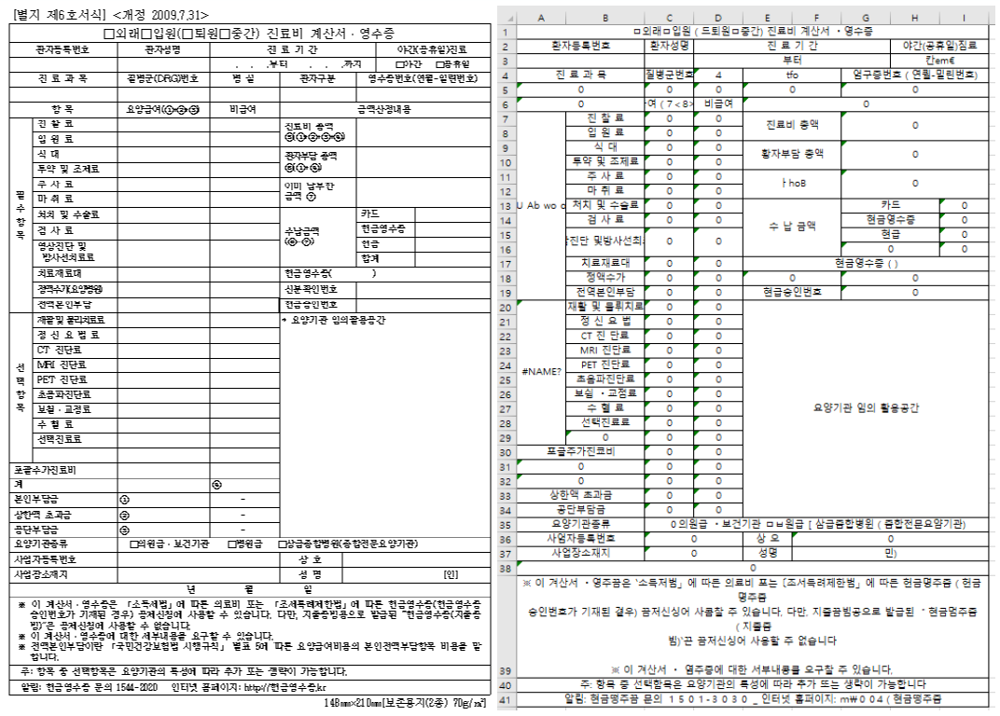

# Deeplearning Based Document Recognition

Project DBDR is a deep learning-based document recognition that was conducted with Samsung SDS. This project makes it easy to convert table-painted documents into digital documents. he project proceeds with the transformation using open source "OpenCV" and "Tesseract".  
  
OpenCV is used to create tables using image processing algorithms. At the same time, separate the table and make it easy for the tesseract to convert. All separated tables are converted to letters by tesseract with coordinates, and the two processes are finally combined to complete electronic documentation.  

# Usage
Before execute this program, we need to following python programs  
```
$ sudo apt-get install cmake git libgtk2.0-dev pkg-config libavcodec-dev libavformat-dev libswscale-dev
$ sudo apt install tesseract-ocr libtesseract-dev
$ pip3 install pytesseract scikit-build openpyxl opencv-python -vvv
```
Next, we can execute just typing below command  

```
python3 run.py [Image_name]
```

# Result
