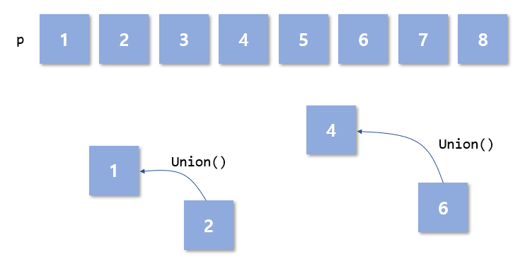
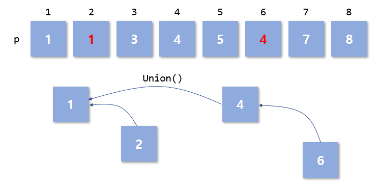
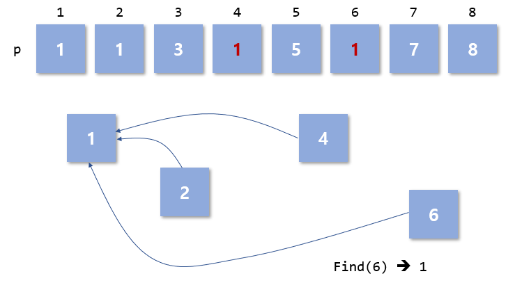

# Disjoint Set
 Disjoint set은 group을 형성하는데 있어서 아주 좋은 알고리즘이라고 할 수 있다. 정확히는 **서로 중복되지 않는 원소의 합집합**을 나타낸다. 이 Disjoint set을 나타내기 위하여 union과 find 알고리즘이 사용된다. `Union()`은 두 서로다른 원소를 하나의 집합으로 만드는 함수고,  `Find()`는 해당 원소가 속해있는 집합을 알아내는 함수이다.  
Disjoint set의 구현을 위하여 여러 방법(링크드 리스트, 벡터 등)이 사용되지만 이번은 **배열**을 통한 구현을 진행한다.

# Code
```
int p[UNION_SIZE]

int Union(int a, int b) {

	int ap = Find(a);
	int bp = Find(b);

	if (ap != bp) {
		p[bp] = ap;
	}
}

int Find(int n) {
	if (p[n]  == n) return n;
	else {
		p[n] = Find(p[n]); // memo(path compression)
		return p[n];
	}
}
```
# Description

그림을 통해 설명하는게 제일 쉽기 때문에 그림으로 나타낸다.  

  
  
 `p`는 각각의 원소의 그룹을 나타내는 배열이라고 할 수 있다. 배열을 사용한 disjoint set에서는 각각의 원소의 번호로 초기화 한다. 따라서 다음과 같은 초기화가 필요하다.

```
for(int i = 0; i < UNION_SIZE; i++)
	p[i] = -1;
```
 만약 이 상태에서 1과 2, 4와 6이 각각 union하게 되면 보다 작은 번호쪽의 그룹으로 합쳐지게 된다. 이 때 `Union()`함수를 보게되면 `Find()`를 통하여 각 원소의 그룹을 알아낸 후 작은쪽의 그룹으로 합쳐지는 모습을 확인할 수 있다. 그림에서는 이 합쳐지는 모습을 화살표로 가리키게 했다. 
`Find()`는 재귀로 구현되는데, `p[n]`을 확인하면서 이 값이 본인의 값이 같다면 그룹에 소속되 있는게 아니기 때문에 자기 자신의 번호를 `return`하게 된다. 하지만 아닐 경우 `p[n] = Find(p[n])`을 진행하게 되는데 이는 `p`배열의 값을 통해 최상위 값을 설정하며 보다 빠른 성능을 내기위해 memo하는 것이라고 볼 수 있다. 이를 **path compression**이라 한다. 최상위는 항상 자신의 원소번호를 가지고 있기 때문이다.
그리고 그룹의 번호를 `return` 하게 된다.  
이 후의 모습을 나타내면 다음과 같다.  
  
  
  
 위의 그림 처럼 `p`배열의 값은 최상위 값으로 바뀌게 된다. 이 상태에서 4와 6의 그룹이 1과 2의 그룹으로 합쳐지게 된다면 위의 그림처럼 화살표가 이어지게 된다. 여기서 주목해야하는 점은 `Find(6)`을 진행하게 된다면 원래는 4를 가리키고 있던 `p[6]`이 memo의 과정을 거치면서 1로 바뀌는 모습이다. `Find()`가 불린 이후 최종적으로 위의 과정을 마치게 된 이후 `p`배열의 모습은 다음과 같다.  
  
  

Union과 Find의 time complexity는 **O(logN)** 이다.

# Usage

[BOJ - 친구 네트워크](https://www.acmicpc.net/problem/4195)  
