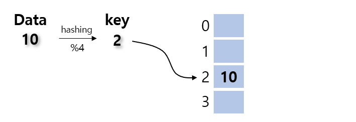
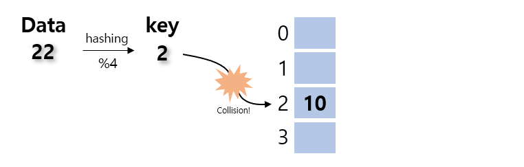
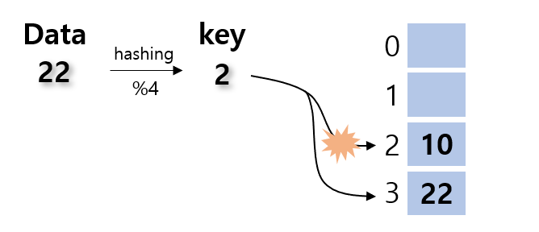
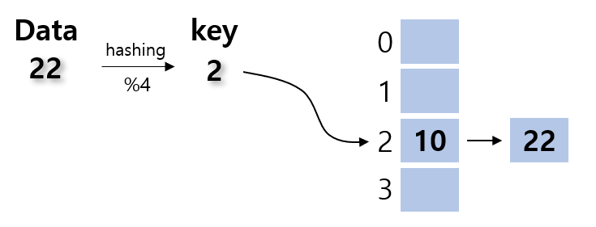

# Hash
Hash 함수는 Page table, cache, TLB등 여러 하드웨어 아키텍쳐에서도 사용되는 아주 핵심적인 자료구조라 할 수 있다. 하지만 이렇게 중요한 자료구조임에도 불구하고 해쉬의 원래는 굉장히 간단하다고 볼 수 있다.   
사실 hash는 현재 data를 변형해서 key로 만든다음 해당 key를 주소값으로 이용하여 바로 접근하는 방법이다. 따라서 hash table에 등록된 자료를 가져오기 위한 시간은 O(1)로 아주 강력한 성능을 자랑한다. 따라서 많은 자료구조를 요구하는 프로그램이나 임시적으로 data를 저장하기 위한 하드웨어적 공간에는 hash가 자주 사용된다고 볼 수 있다.  
하지만 hash가 강력하다 하지만 단점이 없는 것은 아니다. Hash table의 공간에 따라서 hash의 들어가는 자료가 중복(**collision**)되는 횟수가 달라지게 되는데 만약 hash table의 크기가 작다면 중복될 가능성이 매우 높아지게 된다. 하지만 hash table의 크기가 크다면 collision은 작아지지만 memory를 차지하는 공간이 많은 단점을 가지고 있다.  
따라서 hash를 사용하기 위해서는 적절한 크기와 적절한 collision을 조절해줘야한다.

# Code
```
1  unsigned int hasing(char* str) { 
2  	unsigned key = 0, p = 1;
3	for (int i = 0; str[i]; i++) {
4		key += str[i] * p;
5		p *= PRIME_NUM;
6	}
7	return key % HASH_SIZE;
8  }
```
# Description
위의 코드는 사실 string을 위한 hash함수라고 볼 수 있다. 길이가 정해지지 않은 문자열을 다룰때 위와 같은 hashing과정을 거쳐 key를 생성하게 된다. 보통 hash table은 배열로 작성되게 된다. 따라서 배열의 index는 음수가 될 수 없다. 이를 위해 함수의 반환형은 unsigned형을 이용하여 만약 overflow가 날 경우에도 양수값을 유지하도록 한다.  
함수의 진행은 간단하다 key라는 unsigned형 변수를 선언하고 각 자리 값을 prime number와 곱하며 더하게 된다. 굳이 prime number를 정한 이유는 소수의 곱은 collision의 확률이 적기 때문이라고 볼 수 있다. 마지막으로 구해진 key의 값은 hash table의 값을 넘을 수 없다. 따라서 마지막에 **Line 7**처럼 %연산을 통해 table의 크기를 넘지 않도록 return하게 된다.  
만약 숫자의 경우는 간단하게 해당 값에 hash table size로 %연산을 진행해주면 된다. 만약 hash table의 크기보다 들어오는 값의 크기가 더 작다면 해당 값을 그대로 key로 이용하는 것이 더 바람직하다.  

# How to solve the collision?
Hash table은 이 collision을 어떻게 해결하냐에 따라 성능차이가 확실하게 달라진다.  

<p align="center"></p>

위의 그림을 보면 크기 4의 hash table에 data 10을 넣을 경우이다. Hash table에는 아무 값이 없기 때문에 해당 값이 그대로 들어가게 된다. 하지만 만약 22의 값이 들어온다 하면 다음과 같은 현상이 발생하게 된다.

<p align="center"></p>

이 경우 hash 에서는 여러 collision을 해결하는 방법이 있지만, 여기서는 두 가지 방법을 소개한다.  

### Open Addressing
<p align="center"></p>
Open Addressing은 이 경우 바로 아래의 data공간에 data를 넣는 방법이다. 따라서 값은 위와 같이 3의 주소공간에 값이 들어가게 된다.
이 방법을 사용하게 된다면 추가의 공간이 필요없이 hash table만으로도 이용가능한 장점을 가지고 있다. 하지만 table의 크기보다 더 많은 값이 들어올 경우 문제가 될 수 있기에 적은 데이터를 처리할때 유리한 방법이라고 볼 수 있다.  

### Chaining
  <p align="center"></p>
Chaining은 단지 linked list로 이어주기만 하는 간단한 방법이다. 따라서 hash결과는 위와 같은 결과를 가지게 된다. 이 방법을 사용하게 되면 추가의 공간만 있다면 간단하게 collision을 해결 할 수 있다. 하지만 만약 같은 key를 가지는 수많은 data가 들어왔을 경우 look up하는 시간에 의해 hash의 성능이 저하할 수 있는 단점을 가지고 있다.