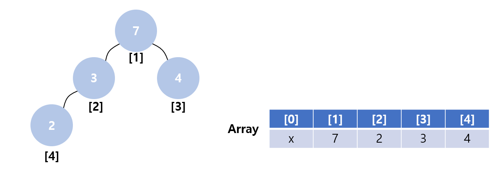
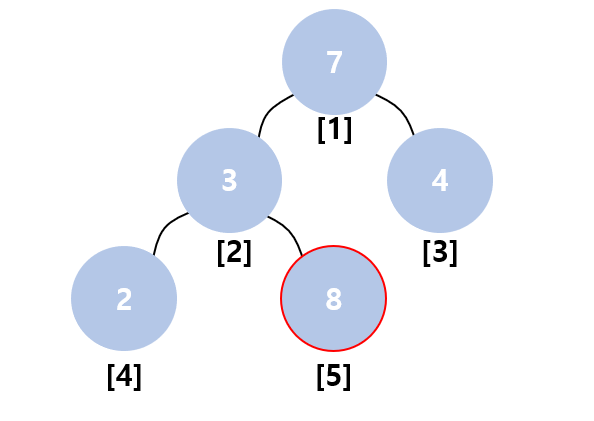
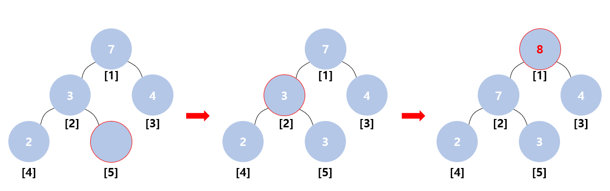
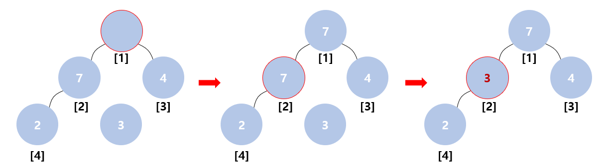

# Heap
Heap은 두 가지 종류 Max heap과 Min heap이 존재한다. Heap 자료구조는 항상 맨 위에 자료구조 내 가장 큰 값(**Max heap**)이나 가장 작은 값(**Min heap**)이 존재하게 된다. 보통 이 heap 자료구조는 우선 순위 큐 (priority queue)에서 사용된다. 또한 heap은 가장 작은 값이나 가장 큰 값을 바로 불러오고 싶은 구조에서 자주 사용되는 자료구조이다. 보통 이 heap은 2개의 node를 가진 2진 tree로 표현하며 배열로 구현이 되어 있다. Heap이 사용하는 배열은 index의 사용을 위하여 0을 사용하지 않고 1부터 사용하게 되는데, 다음과 같은 규칙이 존재한다. 
  
* current index에 2를 곱하면 왼쪽 자식노드이다.  
* current index에 2를 나눈 몫은 부모 노드이다.  
  
이를 적용하여 Max heap을 그림으로 나타내면 다음과 같다.  
<p align="center"></p>
위의 그림처럼 배열의 0번째 index는 사용하지 않으며 index 2의 왼쪽 자식노드가 index 4인 것을 보아 위의 규칙을 만족하는 것을 볼 수 있다.  
이 heap 자료구조에 새로운 value가 들어오게 될 경우 다음의 코드를 진행하게 된다.  

# Heap Push Code
```
1	void push(int val) {
2		if (size == MAX_HEAP_SIZE) {
3			return;
4		}
5		int cur = ++size;
6		while (cur != 1 && heap[cur >> 1] < val) {
7			heap[cur] = heap[cur >> 1];
8			cur >>= 1;
9		}
10		heap[cur] = val;
11	}
```
Heap에서의 push는 다음을 기억하면 된다.  
* 맨 마지막에 새로운 값을 넣고 자리를 찾는다! 
  
만약 위의 그림에서 새로운 값으로 8이 들어오게 된다면 아래와 같은 상태가 된다.  
  
<p align="center"></p>  
  
 새롭게 들어온 8은 **line 5**에 의해 마지막에 추가되며 **line 6** 의 `while`문을 통하여 자리를 찾는 것을 진행하게 된다. 하지만 자리를 찾는 과정은 heap에 아무 것도 없을때는 진행하면 안되기 때문에 `cur != 1`가 `while`문의 조건에 들어가게 되고 또한 클 수록 상위 노드에 위치 해야하므로 현재 위치의 부모 노드보다 클 경우 `while`문을 진행한다. **line 7** 통하여 부모노드와의 자리를 뒤바꾸고 현재 위치는 부모 노드가 되게 된다. 마지막으로 **line 10**에서 들어온 값을 넣어주어 완료하게 된다.  
위의 그림의 경우 다음과 같이 진행된다.  
<p align="center"></p>  

# Heap Pop Code
```
1	void pop() {
2		if (!size) {
3			return;
4		}
5		int e = heap[size--];
6		int cur = 1, ch = 2;
7		while (ch <= size) {
8			if (ch + 1 <= size && heap[ch] < heap[ch + 1]) ch++;
9			if (heap[ch] <= e) break;
10			heap[cur] = heap[ch];
11			cur = ch; ch *= 2;
12		}
13		heap[cur] = e;
14	}
```
Heap의 pop은 가장위의 노드를 빼내고 자료구조내 가장 큰 값을 1번 index에 놓는 역할을 진행한다.  Heap에서의 pop은 다음을 기억하면 된다.  

* 첫 번째를 없애고 마지막 친구를 넣어 자리를 찾아가자! 
  
이렇게 진행하게 되면 자연스럽게 heap[1]에는 이후 가장 큰 값이 위치하게 된다. 그림을 통해 설명을 진행하면 다음과 같다.  
  
<p align="center"></p>  
  
먼저 마지막 노드의 값을 **line 5**에서 `e`에 저장하게 된다. 동시에 size를 줄여주게 된다. 다음은 맨 위의 노드를 제거하기 위하여 `cur`의 값을 1로 설정하고 왼쪽 자식의 index로 `ch`를 2로 설정하게 된다. 
**line 7**의 `while`문을 통하여 자식의 node가 `size`의 범위까지 탐색을 진행하게 된다.  
**line 8**에서는 왼쪽과 오른쪽 자식의 node중 어느 곳을 선택할지 정하게 된다. `if`문 내부의 `ch + 1 <= size`는 `size`가 감소한 트리의 구성의 마지막에 오른쪽 자식이 있는지에 대한(인덱스 값이 유효한지) 판단을 하게된다. 만약 오른쪽이 존재하고 오른쪽 자식이 클 경우 부모노드로 올려주게된다. 위의 그림에서는 7과 4 중 큰 노드는 7이기 때문에 7의 index를 그대로 가지고 있게 된다.  
**line 9**에서는 현재의 자식노드 index의 heap값과 마지막 값 `e`의 값을 비교했을 경우 해당위치가 `e`를 놓을 위치라고 판단된다면 그대로 `while`문을 탈출하게 된다.  
아닐 경우 아래로 더 탐색을 진행해야 하므로 **line 10**과 **line 11**의 code를 진행하게 된다.  
