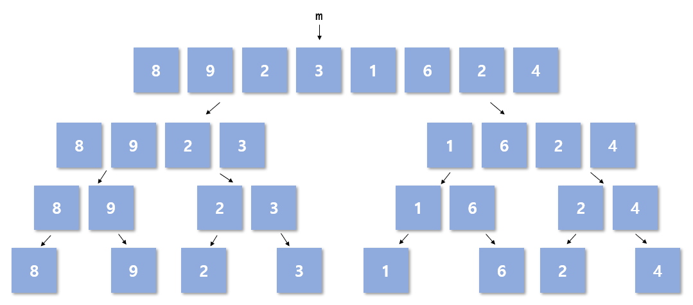

# Merge Sort
Merge sort는 merge라는 단어와 맞게 합병정렬이라고도 불리며 각각의 배열의 범위를 합치며 정렬을 진행하는 정렬 알고리즘이다.    
보통 merge sort는 quick sort와 비교되어서 이야기 되지만 merge sort자체로도 아주 빠른 정렬 알고리즘이라고 할 수 있다.  
Merge sort와 quick sort에 대한 비교는 마지막에 다루도록 한다.

# Code
```
1  int* sort; // we need additional area for msort.
2 
3  void _msort(int l, int r, int* a) {
4	if (l < r) {
5		int m = (l + r) >> 1;
6		int i = l, j = m + 1, k = l, u;
7		_msort(l, m, a);
8		_msort(m + 1, r, a);
9		while (i <= m && j <= r) {
10			if (a[i] <= a[j])
11				sort[k++] = a[i++];
12			else
13				sort[k++] = a[j++];
14		}
15		if (i > m) {
16			for (u = j; u <= r; u++)
17				sort[k++] = a[u];
18		}
19		else {
20			for (u = i; u <= m; u++)
21				sort[k++] = a[u];
22		}
23		for (u = l; u <= r; u++)
24			a[u] = sort[u];
25	}
26  }
```
# Description
Merge sort는 quick sort와 마찬가지로 재귀로 구현이 된다. 하지만 다른점이 있다면 quick sort가 정렬을 진행한 다음 재귀를 호출한다면 merge sort는 각각의 행렬을 나눈뒤 정렬을 마지막에 진행하게 된다.  행렬을 끝까지 나눈 뒤, 다음의 그림처럼 다시 합치며 진행하게 된다.



위의 그림처럼 **Line 7-8** 부분의 분할을 먼저 진행한 뒤 아랫 부분의 merge로 넘어가게 된다. 위의 그림은 각각의 `msort`가 호출되면서 나눠지는 모습을 나타낸다.  
그림 처럼 하나의 원소까지 분할을 진행한 뒤 이어지는 merge의 과정을 그림으로 나타내면 다음과 같다.  


**Line 9**에서는 중간지점인 i와 j를 비교하며 m을 기준으로 작은 값을 k번째에 차곡차곡 쌓아 넣는다. 이후 **Line 15**부터는 조건에 따라 남은 부분에 대한 것을 넣어주게 된다. 
마지막으로 임시 배열에 정렬해 둔 것을 원래의 배열에 옮기는 **Line 23-24**를 거침으로 merge sort가 끝이난다.  Merge sort도 quick sort와 마찬가지로 time complexity는 O(NlogN)이다.  

# Compare with Quick sort

[Quick sort](./QuickSort.md)와 Merge sort를 두고 비교했을 때 빠른 것은 사실 quick sort라고 할 수 있다. 그에 대한 이유는 다음의 그림을 보면 알 수 있다.  
  
<p align="center"></p>
  
먼저 merge sort는 다음과 같이 처음부터 끝까지 왓다갔다하면서 진행되는 모습을 볼 수 있다. 이는 processor의 cache locality와  관련이 있게 되는데, 크기가 큰 배열을 처리할 때는 locality의 이점을 사용할 수 없게 된다.  
  
<p align="center"></p>
  
하지만 quicksort는 다음과 같이 하나의 지점에 대한 sorting을 진행하면서 나아가게 된다. 따라서 pivot을 기준으로 계속 cache에 남아있게 되어 locality의 이점을 확보할 수 있다.  

### Reference
[why quick sort better than merge sort](https://medium.com/pocs/locality%EC%9D%98-%EA%B4%80%EC%A0%90%EC%97%90%EC%84%9C-quick-sort%EA%B0%80-merge-sort%EB%B3%B4%EB%8B%A4-%EB%B9%A0%EB%A5%B8-%EC%9D%B4%EC%9C%A0-824798181693)
