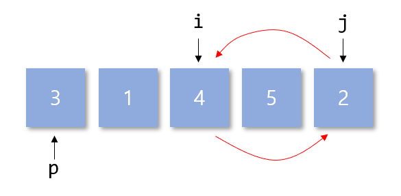
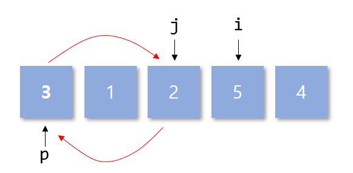
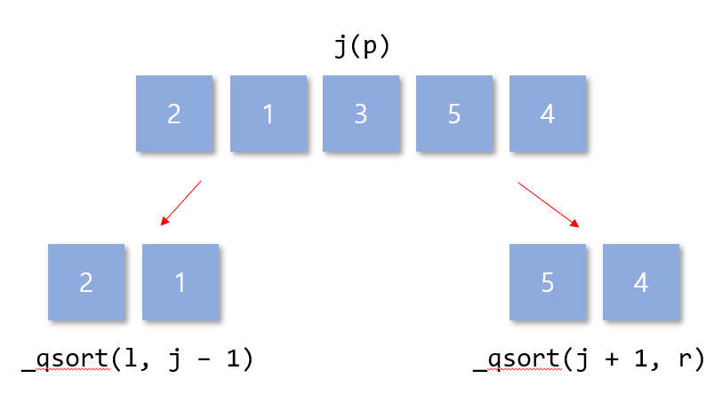

# Quick Sort
Quick sort는 이름에서도 알 수 있듯 가장 빠른 정렬 알고리즘이라고 할 수 있다.  
모든 알고리즘은 함부로 fastest(가장빠른)등의 이름을 붙이지 못한다.. 왜냐면 뒤집힐 수도 있기에.. 아무튼 quick이라는 수식어를 붙인걸 보면 굉장히 자신감이 있는 것이다.  
기존 bubble sort, insertion sort등의 정렬방법은 배열을 각각 배열의 길이만큼 도는 O(n^2)의 time complexity를 보여주지만 quick sort는 훨씬 빠른 속도로 처리가 가능하다.  

# Code
```
1  void qsort(int l, int r, int* a) {
2  	if (l < r) {
3  		int i = l;
4  		int j = r + 1;
5  		int p = a[l];
6		do {
7			do i++; while (i <= r && a[i] < p);
8			do j--; while (j >= l && a[j] > p);
9			if (i < j) {
10				int t = a[i]; a[i] = a[j]; a[j] = t;
11			}
12		} while (i < j);
13		int t = a[j]; a[j] = a[l]; a[l] = t;
14		qsort(l, j - 1, a);
15		qsort(j + 1, r, a);
16	}
17  }
```
# Description
Quick sort는 보통 재귀함수로 작성된다. 하나의 값을 정해서 그 값을 기준으로 작은 값을 왼쪽, 큰 값을 오른쪽으로 이동시키게 된다.  
**Line 2**의 `if` 부분에서 재귀함수의 끝을 설정하게 된다. l은 r을 넘어가는 순간 이 quick sort의 재귀가 끝이 난다. **Line 3**부터 **Line 5**는 각각의 위치를 선정해준다. `i`의 값은 현재 기준 가장 왼쪽이며 `j`의 값은 현재 기준 가장 오른쪽이라 할 수 있다.  
**Line 5**에서는 `pivot`이라고 하는 기준 값의 설정을 하게 된다. 사실 이 값에 따라서 quick sort의 실행속도가 경우에 따라 달라지지만 일단은 가장 왼쪽의 값을 기준값으로 설정하게 된다.  


위의 code를 그림으로 나타내면 다음과 같다. do/while문을 사용하기 때문에 i와 j의 값을 각각 위 그림과 같이 설정하지만 사실 i는 두 번째, j는 마지막 부터 비교를 하게 된다.  p의 값은 가장 왼쪽인 3이라고 볼 수 있는데 **Line 7-8**을 통하여 이 p값과 비교를 진행하면서 각각 왼쪽 오른쪽에 보낼 것을 선택하게 된다.  



i와 j는 각각 조건에 따라서 위의 그림처럼 결정되는데, 이후 i가 j보다 작다면 두 값을 바꾸게 된다. 이 후 다음과 같은 위치에서 i와 j가 결정되게 되는데, 이는 while문의 탈출조건과 같기에 빠져나오게 된다.



위의 그림은 while문을 빠져나간 직후의 모습이다. 이 값은 현재 p의 값을 기준으로 오른쪽 왼쪽으로 진행한 부분이기 때문에 p를 j와 바꿔주는 과정을 통해 중간으로 옮겨줘야한다. 따라서 **Line 13**은 두 값을 바꾸어 주는 역할을 진행하게 된다.  
다음 line부터는 재귀함수의 호출을 진행하게 되는데, 이 때의 모습은 다음과 같이 p를 기준으로 왼쪽 오른쪽의 범위를 이동하게 된다.  



재귀를 호출한 모습은 위의 그림과 같다. 각각 `pivot`인 `j`의 위치에서 왼쪽, 오른쪽의 범위에 해당되게 되고 위의 과정을 반복하게 된다.  
따라서 이 Quick sort의 time complexity는 O(NlogN)이다.


  
